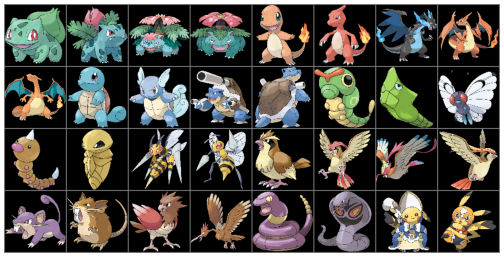
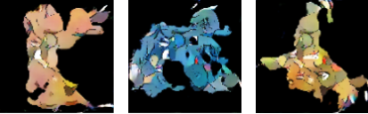
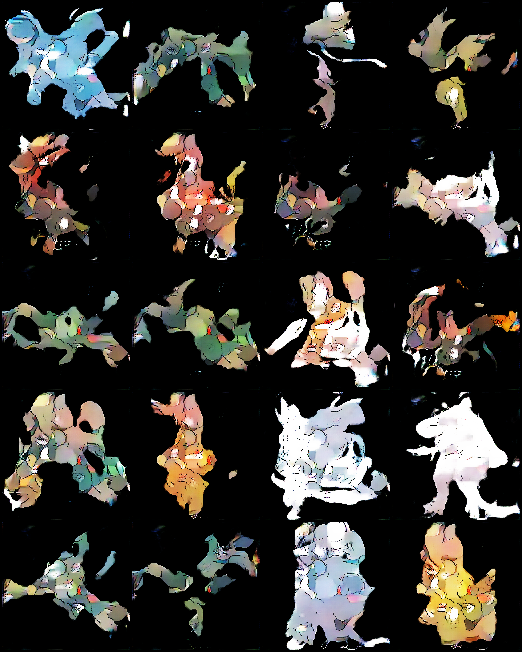

# GAN - Pokémons
This project focuses on generating new Pokémon images by using convolutional neural networks as a generator and discriminator. The GAN is trained with the original [Pokémon dataset](https://www.kaggle.com/kvpratama/pokemon-images-dataset). \
For simplicity, the alpha channel was omitted so that only RGB images with a size of 128 x 128 were considered.

**Remark:** The png images must be saved in the `data` folder as `pokemon_dataset`.

The dataset has the following properties:
* Total amount: 819 images
* Size: 41 MB
* MIME-Type: png
* Shape: 256 x 256 x 4

<p align="center">
  
</p>

### Resources
[FID-Score](https://arxiv.org/abs/1706.08500) \
[FID-Implementation](https://github.com/mseitzer/pytorch-fid) \
[Generative Adversarial Nets](https://arxiv.org/abs/1406.2661)\
[Differentiable Augmentation for Data-Efficient GAN Training](https://arxiv.org/abs/2006.10738) 
## Usage

### Installing Packages

For the packages use miniconda. See [Miniconda](https://docs.conda.io/en/latest/miniconda.html).

Use the Anaconda Prompt terminal for the following steps:
```
conda create --name myenv python=3.8.5 pip
```

When conda asks you to proceed `proceed ([y]/n)?`, type `y`:

Activate the new environment: 
```
conda activate myenv
```

Install [pytorch](https://pytorch.org/get-started/locally/)
```
conda install pytorch torchvision torchaudio cudatoolkit=11.3 -c pytorch
```

Install the packages via requirements.txt
```
 pip install -r requirements.txt
```

### Preprocessing images

The images will be resized to `128 x 128 x 3` at the beginning

```
python -m pokemon.resize_images
```
### Train new generator
A trained model is available under`pokemon\trained models`.
If you want to train a new generator, you have to execute this command
```
python -m pokemon.generator.train
```
The hyperparameters are in the "train_config.json" file.\
The trained models can be found in the folder `pokemon\trained_models`
### Generate images

For generating new Pokémon images, you can choose between two modules. \
**For single images**
```
python -m pokemon.generate_images
```
<p align="center">
  
</p>

**For grid images**
```
python -m pokemon.generate_grid_images
```
<p align="center">
  
</p>

The images can be found under the following paths:
* `pokemon\data\generated_images`,
* `pokemon\data\generated_grid_images`.

### Evaluation
The FID-Score will be used to evalute the GAN. \
It is important to create the same number of images as the original data. \
The following folders are required:
* Images: `pokemon\data\pokemon_preprocessed`, with the size of 819 images,
* New Images: `pokemon\data\generated_images`, with the size of 819 images.

To evaluate the Pokémon images, you have to run
```
python -m pokemon.evaluation.pytorch-fid.src.pytorch_fid.fid_score --num-workers 2 pokemon\data\generated_images pokemon\data\pokemon_preprocessed
```

| Model | FID-Score |
|:----------|:-------------|
| 2022-03-08_15_49_59.pt |  173.13 |
